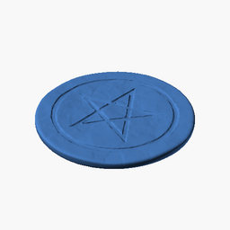
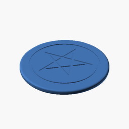
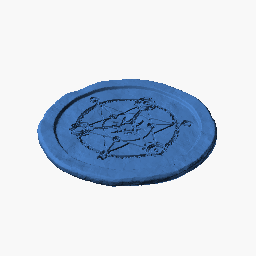
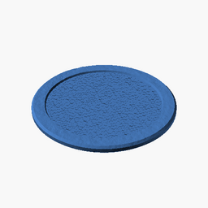
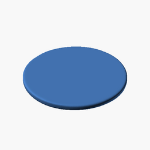
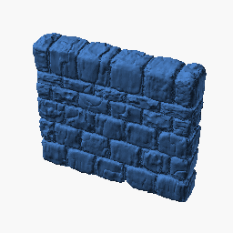
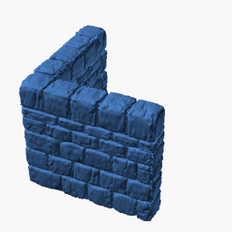
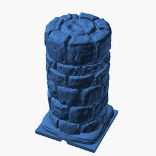
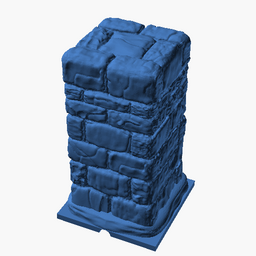

# openforge-eobermuhlner

Extensions to the OpenForge tile set from Devon Jones.

[devonjones/OpenForge](https://github.com/devonjones/OpenForge)

[devonjones/openforge-tutorials](https://github.com/devonjones/openforge-tutorials)

### Floor Tiles with Circle Cutout

These floor tiles have a circular cutout and are designed to be used with a circle inset piece (see below).

They are modified versions of Devon Jones original work.

- Dungeon Stone 2x2 Tile for 2x2 inch circle

## Circle Insets

The circle insets are designed as circular pieces that fit well into a specially designed floor tile with circular cutout.

- Pentagram - rough stone (2x2 inch)

- Pentagram - smooth stone (2x2 inch)

- Pentagram - smooth (2x2 inch)

- Magic Circle 1 - rough stone (2x2 inch)

- Magic Circle 1 - smooth (2x2 inch)

- Magic Circle 2 - rough stone (2x2 inch)

- Mosaic - smooth stone (2x2 inch)

- Circle - rough stone (2x2 inch)

- Circle - smooth (2x2 inch)

The magic circles are based on the excellent work of [Propnomicon](http://propnomicon.blogspot.com/):
- [Magic Circle 1](http://propnomicon.blogspot.com/2016/09/magic-circle.html)
- [Magic Circle 2](http://propnomicon.blogspot.com/2014/02/magic-circle.html)

## Hollow Standard Tiles

The following pieces are hollowed out versions of Devon Jones original work.

They are designed to be printed directly on the flat bed of a resin printer.

A little drain hole at the bottom prevents suction problems and avoids that the print is ends up filled with liquid resin.

- Dungeon Stone - Hollow Wall 2x2 inch

- Dungeon Stone - Hollow Corner Wall 2x2 inch

- Dungeon Stone - Hollow Round Pillar 2x2 inch

- Dungeon Stone - Hollow Square Pillar 2x2 inch

